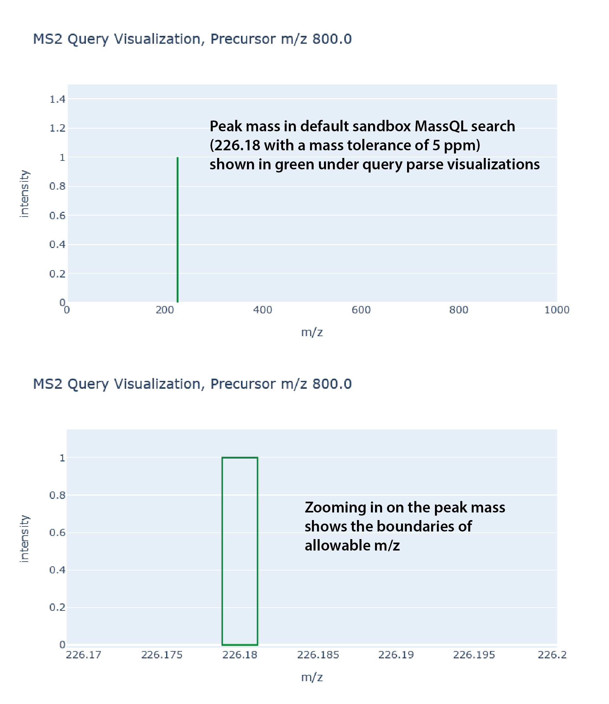
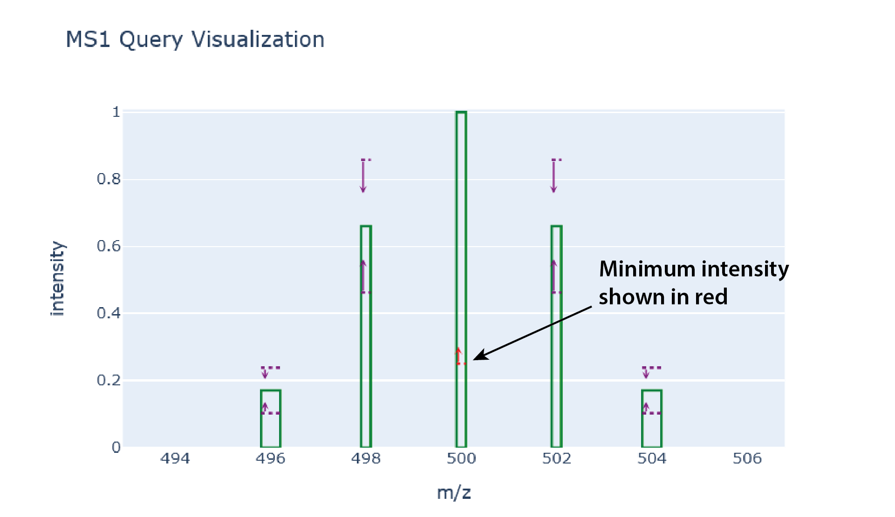
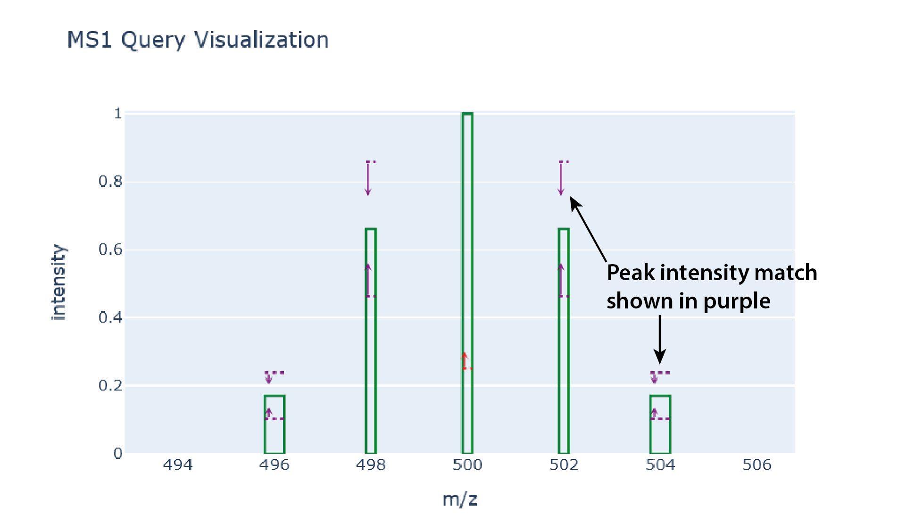
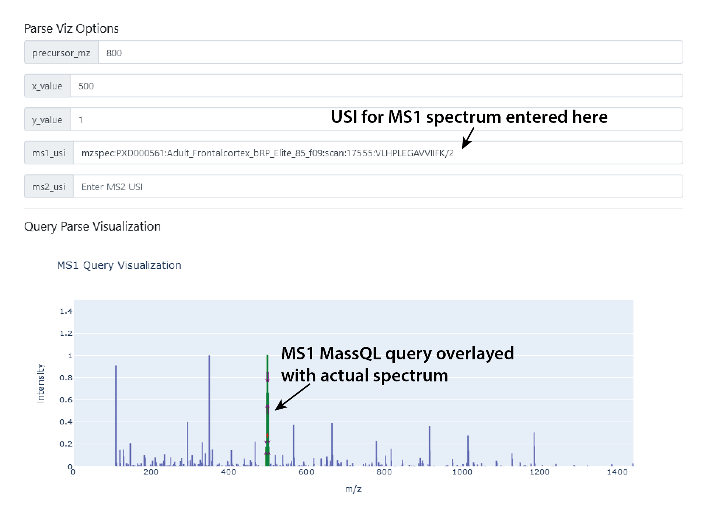

MassQL has a visualizer to help you figure out what your query is looking for. It is available at our [sandbox](https://msql.ucsd.edu/). 

The following will describe but the shapes and symbols mean

## MS Peak Mass

This can be either MS2PROD or MS1MZ, green boxes around where the allowble m/z tolerance determined by qualifiers is set. 

## MS2 Neutral Loss

These are MS2NL keywords and are shown as red boxes. 

## Peak Intensity Minimum

This is a red dashed line, with a small red arrow indicating it is a minimum. 

## Peak Intensity Match

The ranges are purple dashed lines with arrows denoting the included rage. 

## Variables

You can set the variables you want with Value X and Value Y

## Overlaying Real Data

If you enter the USI (universal spectrum identifier) for the MS1 or MS2 spectra, you can overlay your query with an actual spectrum to workshop what you're trying to find. 

